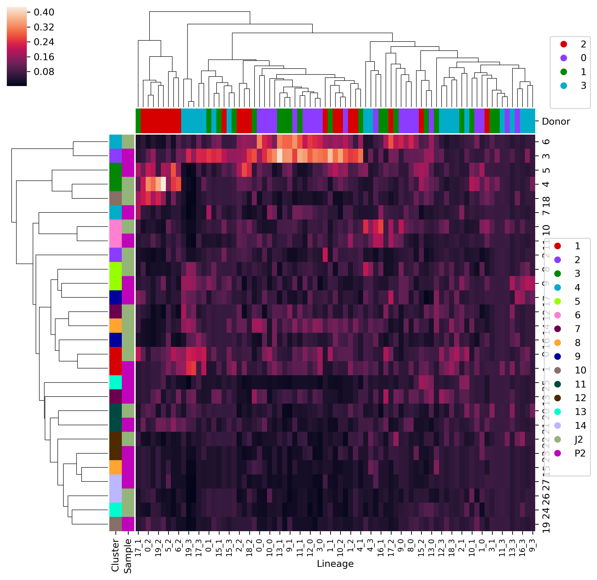

# Clone-Cell type relationship Writeup

Created: Mar 22, 2021 5:45 PM
Status 1: No

# Introduction

Brief description of the task needed to get done.

---

- Once we get the clones, and we correlate them with cell types, we want to see if there's any relationship between the clones and the cell types
- This will be similar to Lareau et al 2021, and Dawn et al 2021.

# Current Report:

This can be links to the subtask pages , or can include more detail

---

## A. Flt3l + Control cytokines

## B. Clustering cells on scATAC-seq peaks to enable cell type calling

[Control](./reports/clusters/clusters_P2.png)

[Flt3l](./reports/clusters/clusters_J2.png)

### Marker DC TFs from Dawn

## C. Multiplexing Donors

[Donors in 'cell type' embedding](./Analysis/lineage_and_peakclusters/results/jan21_2021/cells_merged_lin_and_peak_donors.tsne.subplots.png)

## D.  Calling clones on the cells

See Google slides for now.

## E. Grouping cells by both cell-types and Clones

[Clone Lineage 100 clones each donor](./Analysis/lineage_and_peakclusters/results/jan21_2021/cells_merged_lin_and_peak_nclones100.overlap_percent_normClone.png)

Note that one donor did not have any confident clones called (p>0.9 a cell is assigned to a clone) when n-clones is 100.

## F. Inspired by Dawn et al Fig2. , dim-red cell-type:clone cell count matrix highlights lineages that are certain found certain 'fate-cluster', so we can find some lineages

- Donors are separated
- There are still dynamics can be seen between lineages and cell types

['Fate-Clusters'](./notebooks/jan21_2021/clone_fate/clone_fate_scanpy_separateConditions.ipynb)

- UMAP of Clone-Lineage 20 clones each donor.
    - Each lineage (flt3l and wt are separated) are their own datapoint, with number of cell-type clusters being the number of features. All donors included

['Fate-Clusters' separating out the donors](./notebooks/jan21_2021/clone_fate/clone_fate_scanpy_separateConditions_SplitDonors.ipynb)

## To Do:

- A: The 10x seems to not mix flt3l and WT very well.
    - Can try a few different parameters from 10x or a UMAP method , but the umap shouldn't matter too much
    - Another alternative is to use cell similarity score based on prior scATAC-seq values.
    - Can also use marker genes for this
- C: Still need to nail down the clones
- E. This looks very interesting and promising, but need good cell type annotations and flt3l-wt mix
